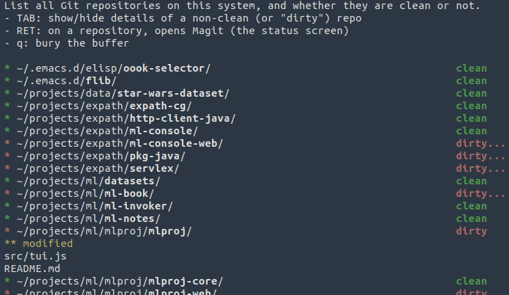

# emacs-flib
A potpourri of Emacs code and libraries of mine.

To "install", just clone the repository somewhere and add it to your
`load-path`.  For instance:

    > git clone https://github.com/fgeorges/emacs-flib.git ~/.emacs.d/flib

And in your `~/.emacs`:

    (add-to-list 'load-path "~/.emacs.d/flib/src/")
    (require 'fgit-list)
    (setq fgit:repositories
          '(((:path . "~/.emacs.d/elisp/oook-selector/") (:fetch . nil))
            ((:path . "~/.emacs.d/flib/")                (:fetch . t))
            ((:path . "~/projects/ml/datasets/")         (:fetch . t))
            ((:path . "~/projects/ml/ml-book/")          (:fetch . t))
			...
			))

When you `M-x fgit:check-repos`:

